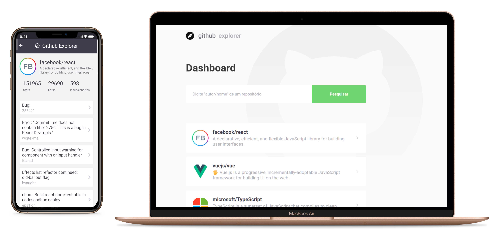

<h1 align="center">
  
</h1>

This project is divided in 2 parts, [WEB](#web) and [MOBILE](#mobile). <br/><br/>
The idea is to make easier to explore github repositories, so you can just type a repository name (the format must be "user/repositoryname") and it will be add
to your "dashboard". You will be able to click on any item of this list and access the repo info, like stars, forks, etc. Later you can come back
and your list will still be there, since all is storaged on your local storage. You can see the website and mobile app working just following the [GETTING STARTED](#getting-started) section.

<br>

<br>

## WEB

### Technologies

- [React](https://reactjs.org/)
- [Typescript](https://www.typescriptlang.org/)
- [React Router DOM](https://github.com/ReactTraining/react-router/tree/master/packages/react-router-dom)
- [React Icons](https://github.com/react-icons/react-icons)
- [Styled Components](https://styled-components.com/)
- [Axios](https://github.com/axios/axios)

<br>

<p align="center">
  
<p>
  
<br>

## MOBILE

### Technologies

- [React Native](https://reactnative.dev/)
- [Typescript](https://www.typescriptlang.org/)
- [React Navigation](https://reactnavigation.org/)
- [React Native Community Async Storage](https://github.com/react-native-community/async-storage)
- [React Native Vector Icons](https://github.com/oblador/react-native-vector-icons)
- [Styled Components](https://styled-components.com/)
- [Axios](https://github.com/axios/axios)

## GETTING STARTED

### Requirements

- [Yarn](https://yarnpkg.com/) or [npm](https://www.npmjs.com/)
- [git](https://git-scm.com/)
- [React Native development environment](https://reactnative.dev/docs/environment-setup)

#### Clone the project and access the folder

```shell
$ git clone https://github.com/DanielMesquitta/githubexplorer && cd githubexplorer
```

### Start web

Inside the the root directory

```shell
# Go to web folder
$ cd web

# Install the dependencies
$ yarn

# Start
$ yarn start
```

### Start mobile

Inside the the root directory

```shell
# Go to mobile folder
$ cd mobile

# Install the dependencies
$ yarn

# Run this if you will emulate on an android
$ yarn android

# Run this if you will emulate on an ios
$ yarn ios

# Start the app
$ yarn start
```
